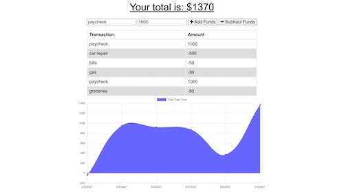

# Progressive Budget

## Table of Contents
* [Description](README.md#Description)
* [Installation](README.md#Installation)
* [Usage](README.md#Usage)
* [URL](README.md#URL)
* [License](README.md#License)
* [Questions](README.md#Questions)

## Description
App for users to add expenses and deposits to their budget with or without a connection.

## Installation
To install, clone this from my repository by entering git clone https://github.com/kelseysanderson/progressive-budget.git in a terminal in a new directory. Then, when successfully cloned, type `npm install` in the terminal within that directory.

## Usage
Following installation, open the terminal in the new directory and enter `npm node server.js` to start the server. Then open your browser and type in localhost:3000 into the address bar in a browser. The live URL can also be found below.

### Screenshot 

## URL
[Live URL to Progressive Budget](https://murmuring-caverns-75427.herokuapp.com/)

## License
Read more about the license here:
https://opensource.org/licenses/MIT

### Questions
If you have any questions, feel free to contact me:

GitHub: [Kelsey Sanderson GitHub](https://github.com/kelseysanderson)

Email:  [Kelsey Sanderson Email](mailto:kelseymonica@gmail.com)
